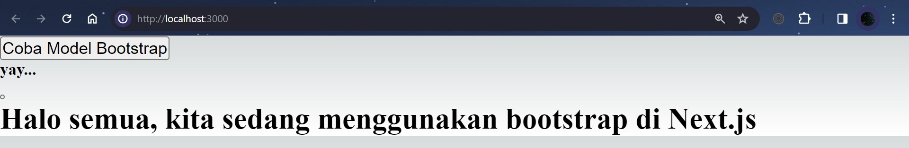

### Nama : Brian Mohamad Safiudin
### NIM : 2141720133
### Kelas : TI-3A
---

# Praktikum 1: Instalasi Redux dan bootstrap

#### Edit file pages/index.tsx menjadi seperti ini.

```tsx
export default function Home() {
  return (      
    <div className="container">
      <div className="row">
        <div className="col-12">
          <button type="button"
                  className="btn btn-primary"
                  data-bs-toggle="modal"
                  data-bs-target="#exampleModal">
                  Coba Model Bootstrap
          </button>
        </div>
      </div>
      <div  className="modal fade"
            id="exampleModal"
            tabIndex="-1"
            aria-labelledby="exampleModalLabel"
            aria-hidden="true">
        <div className="modal-dialog">
          <div className="modal-content">
            <div className="modal-header">
              <h5 className="modal-title text-black" id="exampleModalLabel"> yay... </h5>
              <button
                type="button"
                className="btn-close"
                data-bs-dismiss="modal"
                aria-label="Close"></button>
            </div>
            <div className="modal-body text-black">
              <h2>Halo semua, kita sedang menggunakan bootstrap di Next.js</h2>
            </div>
          </div>
        </div>
      </div>
    </div>
  );
}
```

#### Coba kita jalankan project next.js kita, dan laporkan apa yang terjadi?



- muncul tampilan bootstrap dengan button "Coba Model Bootstrap", tulisan yay... dan Halo semua, kita sedang menggunakan bootstrap di Next.js.

---
